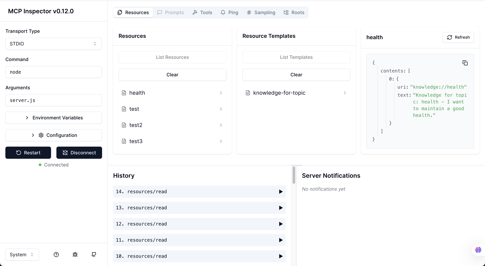

# Demo MCP Server Implementation

This project demonstrates a practical implementation of the Model Context Protocol (MCP), showcasing how to build and integrate MCP-enabled services. The project consists of three main components: an MCP server, a client application, and a knowledge service.

## Project Structure

```
demo-mcp-server-implementation/
├── server/         # MCP server implementation
├── client/         # Client applications (with and without LLM integration)
├── service/        # Knowledge service backend
└── assets/         # Project assets and images
```

## Components

### 1. MCP Server
- Built using `@modelcontextprotocol/sdk`
- Implements tools and resources for knowledge management
- Provides a standardized interface for client-server communication

### 2. Client Applications
- Demonstrates two implementation approaches:
  - Client with LLM integration (using OpenAI)
  - Basic client without LLM
- Uses MCP SDK for server communication
- Implements chat functionality with tool invocation

### 3. Knowledge Service
- Express.js backend service
- Manages knowledge storage and retrieval
- Provides RESTful API endpoints

## Prerequisites

- Node.js (Latest LTS version recommended)
- npm or yarn package manager
- OpenAI API key (for LLM-enabled client)

## Installation

1. Install dependencies for each component:

```bash
# Server
cd server
npm install

# Client
cd ../client
npm install

# Service
cd ../service
npm install
```

2. If using the LLM-enabled client, create a `.env` file in the client directory:
```
OPENAI_API_KEY=your_api_key_here
```

## Running the Application

1. Start the knowledge service:
```bash
cd service
npm run dev
```

2. Start the MCP server:
```bash
cd server
npm run dev
```

3. Run the client (choose one):
```bash
cd client
# For LLM-enabled client
node client-with-llm.ts

# For basic client
node client-without-llm.ts
```

## MCP Inspector

You can inspect the MCP server using the MCP Inspector tool:

```bash
npx @modelcontextprotocol/inspector node server.js
```



## Available Tools and Resources

### Tools
- `store-knowledge`: Store knowledge about a specific topic
  - Parameters: `topic` (string), `content` (string)

### Resources
- `knowledge-for-topic`: Retrieve knowledge about a specific topic
  - URI format: `knowledge://{topic}`

## License

MIT

## Contributing

Feel free to submit issues and pull requests to improve this demonstration project.
